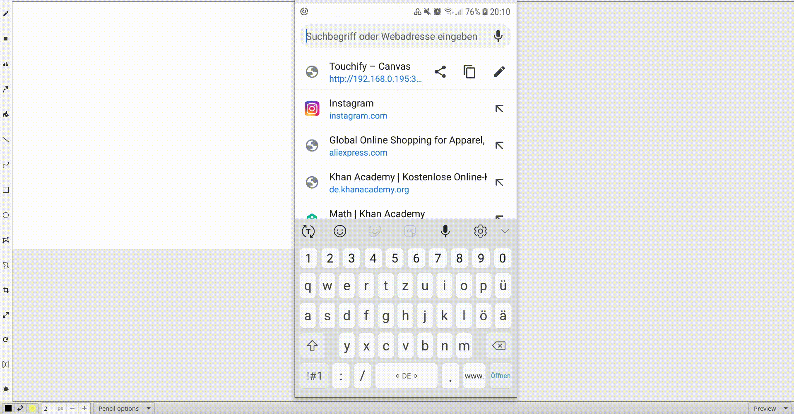

# Touchify
A local web server, that enables you to use your phone to draw on your PC.

<video src="https://github.com/Richie-8DK/touchify/raw/master/demo.webm" controls width="320" height="240"></video>

A gif demonstrating how it works:

https://github.com/Richie-8DK/touchify/raw/master/demo.webm is probably better.

### How it works

1. Run Touchify
2. Open the webpage on your smartphone/tablet
3. Set it to fullscreen
4. Start drawing
5. Use the "update view" button to mirror the image of current desktop area to your phone

#### Running it
Of course you need to have npm installed.
Run these line in the project directory:
```
npm install
npm start
```

#### Opening the webpage

`yourip:3000/index.html`
Open this url on your phone or tablet, replace `yourip` by your desktop pc's local ip address.

### TODO
- multitouch support 
  - pan and zoom -> you can navigate through your screen
  - plam recognition -> draw with your hand resting on your tablet
- UI improvement (make a less ugly UI)
- create qr code of the url to scan with your phone
- hopefully finally getting a click through window to work

------------------------------

# Mathe Brückenkurs
Hallo, die meisten werden deswegen hier drauf gekommen sein. Das ist ein Tool, das ich geschrieben habe um Sachen die am Samrtphone/Tablet gemalt werden in Bewegungen der Maus zu übertragen. Das heißt es funktioniert mit alles Zeichenprogrammen darunter auch BigBlueButton. Wenn es euch auch etwas nützt freut mich das. Wenn ich kleinere Probleme habt es zum laufen zu bringen kann ich euch sicher helfen. Wenn ihr gar keine Ahnung habt wie das geht, könnt ihr warten und hoffen das ich es mal verpacke und als exe, snap und so hochlade. Ich habe vor noch einiges dran zu verbessern. Zur Zeit kann man lediglich im linken oberen Rand zeichnen :/ . Ich gebe keine Garantie das ich nicht doch zu faul bin und mir einfach ein Graphiktablet von Freunden ausleihe. :)